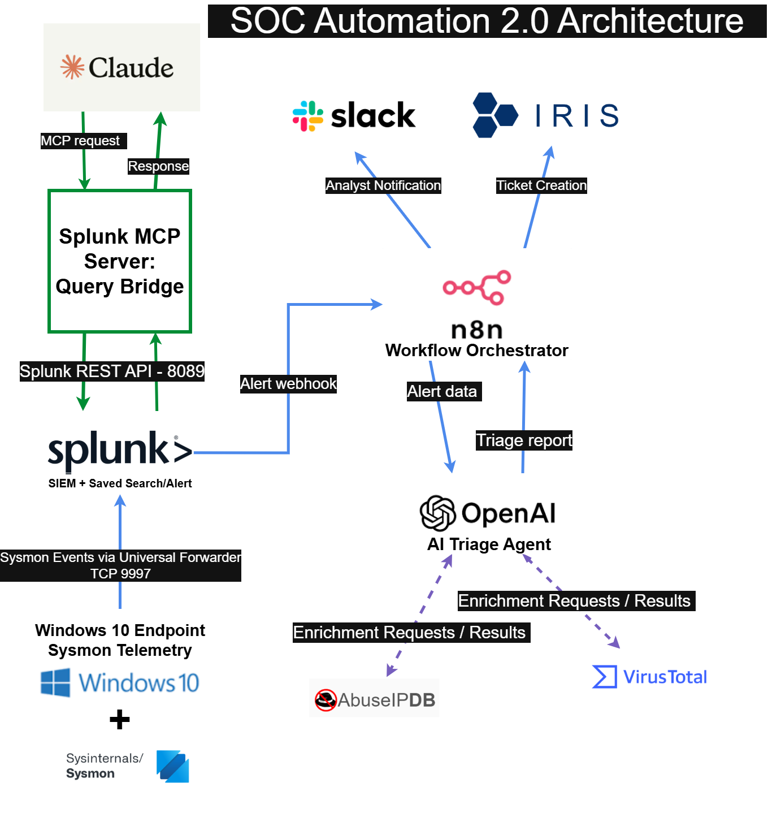

# SOC Automation 2.0 Architecture

## Overview

SOC Automation 2.0 is an end-to-end security alert triage pipeline. Windows and Sysmon telemetry is collected by Splunk, evaluated by a Splunk detection, and forwarded to n8n for automated analysis and response.

n8n coordinates OpenAI analysis, threat-intelligence enrichment, DFIR-IRIS ticket creation, and Slack notification. Claude Desktop and the Splunk MCP server provide a separate, analyst-driven method for searching the same Splunk environment.

## Architecture Diagram

*Diagram file: `screenshots/01-core-automation/SOC-Auto-2-Proj.png`*

## Components

| Component | Role |
|---|---|
| Windows 10 | Lab endpoint that generates security activity and event logs |
| Sysmon | Records detailed process, network, file, and registry telemetry |
| Splunk Universal Forwarder | Sends Windows and Sysmon events to Splunk |
| Splunk | Central SIEM used to index, search, and detect suspicious activity |
| Splunk saved search/alert | Detection logic running inside Splunk that triggers the workflow |
| n8n | Orchestrates alert intake, AI analysis, enrichment, ticketing, and notification |
| OpenAI | Produces a structured triage report from the alert and enrichment results |
| VirusTotal | Enriches hashes, files, URLs, and domains |
| AbuseIPDB | Enriches IP addresses with reputation and abuse information |
| DFIR-IRIS | Receives the completed analysis as an investigation ticket or case |
| Slack | Delivers a real-time notification to the analyst |
| Claude Desktop | Provides an optional natural-language investigation interface |
| Splunk MCP server | Translates Claude requests into authorized Splunk searches |

## Automated Alert-Triage Flow

### 1. Endpoint telemetry collection

Sysmon runs on the Windows 10 endpoint and records detailed endpoint activity. The Splunk Universal Forwarder sends the collected events to the Splunk server over TCP port `9997`.

### 2. Splunk detection

Splunk indexes the incoming events and evaluates them using a saved search or alert. When the search meets its trigger condition, Splunk sends the alert data to the n8n webhook.

`Splunk Detection` is not a separate application. It represents the detection logic running inside the existing Splunk platform.

### 3. Workflow orchestration

n8n receives the webhook and controls the remaining workflow. It prepares the alert context, invokes the OpenAI triage agent, manages enrichment requests, and routes the completed report to the required destinations.

### 4. AI analysis and enrichment

OpenAI evaluates the alert context and produces a consistent triage report containing:

- Alert summary and key evidence
- Severity and confidence assessment
- MITRE ATT&CK mapping
- VirusTotal and AbuseIPDB enrichment results
- Recommended investigation and response actions

VirusTotal and AbuseIPDB are enrichment tools used during analysis. Their requests and results travel through the n8n workflow rather than directly to Slack or DFIR-IRIS.

### 5. Ticketing and notification

After the triage report is returned, n8n performs two response actions:

- Creates or updates a case in DFIR-IRIS
- Sends a summarized analyst notification to Slack

The workflow accelerates triage, but the analyst remains responsible for validating the findings and deciding the final response.

## Claude Desktop and Splunk MCP

Claude Desktop provides a separate analyst-assistance path and is not required for the automated n8n workflow.

The connection operates as follows:

1. The analyst submits a natural-language question in Claude Desktop.
2. Claude sends an MCP request to the locally configured Splunk MCP server.
3. The MCP server converts the request into an authorized Splunk search.
4. The MCP server connects to the Splunk REST API over HTTPS port `8089`.
5. Splunk returns the search results through the MCP server to Claude.
6. Claude summarizes the results for the analyst.

Claude does not connect directly to Splunk, n8n, or OpenAI. The MCP server acts as the controlled query bridge between Claude Desktop and Splunk.

## Network Communications

| Source | Destination | Protocol/Port | Purpose |
|---|---|---|---|
| Windows Universal Forwarder | Splunk | TCP `9997` | Forward Windows and Sysmon events |
| Splunk alert | n8n webhook | HTTP/HTTPS `5678` in the lab | Submit triggered alert data |
| n8n | OpenAI API | HTTPS `443` | Request structured AI analysis |
| n8n/OpenAI agent | VirusTotal API | HTTPS `443` | Threat-intelligence enrichment |
| n8n/OpenAI agent | AbuseIPDB API | HTTPS `443` | IP-reputation enrichment |
| n8n | DFIR-IRIS | Configured HTTP/HTTPS service port | Create or update an investigation case |
| n8n | Slack API | HTTPS `443` | Send the analyst notification |
| Claude Desktop | Splunk MCP server | Local MCP communication | Submit analyst requests and receive responses |
| Splunk MCP server | Splunk REST API | HTTPS `8089` | Run authorized Splunk searches |

## Security Considerations

- API keys, passwords, tokens, and complete webhook URLs are excluded from the repository.
- Credentials should be stored in n8n credentials, protected environment variables, or the local Claude Desktop configuration.
- The Splunk MCP account should use only the permissions required to perform approved searches.
- TLS certificate verification should be enabled outside an isolated lab environment.
- OpenAI-generated findings should be treated as decision support and validated by a human analyst.

## Design Summary

The project contains two connected but distinct paths:

- **Automated workflow:** Windows/Sysmon → Splunk → n8n → OpenAI and enrichment → DFIR-IRIS/Slack
- **Analyst-assisted workflow:** Claude Desktop → Splunk MCP server → Splunk

Both paths use the same Splunk environment. The automated path handles alert triage and routing, while the Claude path supports on-demand investigation and search.
