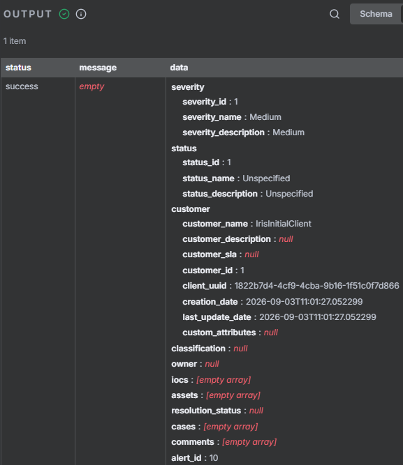
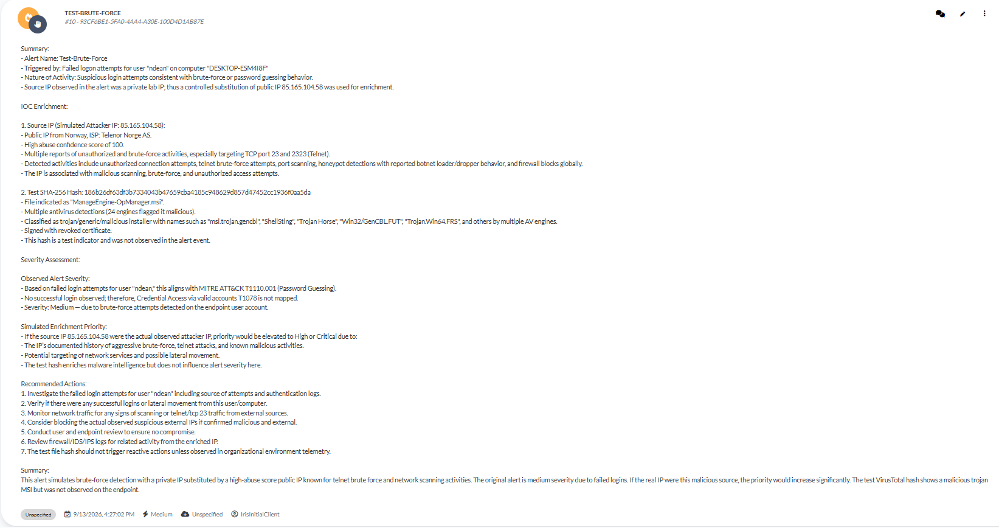

# DFIR-IRIS Integration

## Purpose

This document explains how the SOC Automation 2.0 workflow sends an AI-assisted triage report from n8n to DFIR-IRIS. It covers the alert-creation request, field mappings, severity configuration, validation evidence, security controls, limitations, and analyst-controlled case escalation.

The integration provides a central location for analysts to review and track the alert after the automated analysis is completed.

## Role in the Workflow

After the OpenAI agent generated the structured triage report, n8n sent selected fields to the DFIR-IRIS Alerts API.

```text
Splunk alert → n8n webhook → OpenAI triage
→ DFIR-IRIS HTTP request → IRIS alert record
→ Analyst review → Optional case escalation
```

The workflow used the `POST /alerts/add` endpoint. This created a DFIR-IRIS alert, not a full investigation case.

## Alert and Case Distinction

DFIR-IRIS separates incoming alerts from investigation cases:

- An **alert** is an item awaiting analyst triage.
- A **case** is a formal investigation created when the alert requires escalation.
- An analyst can escalate an alert into a new case or merge it into an existing case.

This design preserved human review. The automation created the initial alert, while the analyst retained control over case escalation.

## n8n HTTP Request Configuration

The DFIR-IRIS node was configured as an authenticated HTTP request.

| Setting | Value |
|---|---|
| Node name | `DFIR-IRIS Alert Creation` |
| Method | `POST` |
| Sanitized endpoint | `https://DFIR_IRIS_HOST/alerts/add` |
| Authentication | Predefined DFIR-IRIS API credential |
| Body type | JSON key-value pairs |
| Response format | JSON |
| Certificate validation | Disabled for the isolated lab only |

The actual internal host, credential identifier, and authentication value were removed from the published workflow.

## Field Mapping

| DFIR-IRIS field | n8n value | Purpose |
|---|---|---|
| `alert_title` | Splunk `search_name` | Identifies the detection that generated the alert |
| `alert_description` | OpenAI triage output | Stores the complete structured analysis |
| `alert_severity_id` | `1` | Creates the alert with Medium severity in this lab |
| `alert_status_id` | `1` | Creates the alert with Unspecified status |
| `alert_customer_id` | `1` | Associates the alert with the lab customer |

### Sanitized Request Body

```json
{
  "alert_title": "={{ $('Splunk Alert Webhook').item.json.body.search_name }}",
  "alert_description": "={{ $json.output[0].content[0].text }}",
  "alert_severity_id": 1,
  "alert_status_id": 1,
  "alert_customer_id": 1
}
```

The published example contains no bearer token, API key, credential ID, or private host address.

## Alert Content

The generated DFIR-IRIS alert included the OpenAI triage report containing:

- Splunk alert name
- Affected endpoint and user
- Failed-logon summary
- Observed severity and supporting rationale
- MITRE ATT&CK mapping
- AbuseIPDB and VirusTotal test context
- Evidence limitations
- Recommended investigation actions

The report clearly identified the AbuseIPDB public IP and VirusTotal SHA-256 hash as controlled test indicators rather than evidence observed in the original failed-logon event.

## Severity and Status Mapping

The following severity IDs were verified in this DFIR-IRIS lab instance:

| Severity ID | Displayed severity |
|---:|---|
| `1` | Medium |
| `2` | Unspecified |
| `3` | Informational |
| `4` | Low |
| `5` | High |
| `6` | Critical |

The workflow used `alert_severity_id: 1` because the observed activity consisted of failed logons without a confirmed successful unauthorized login.

The workflow also used `alert_status_id: 1`, which displayed as Unspecified. This was appropriate for a newly created alert awaiting analyst review.

These identifiers are configuration-dependent and should be confirmed against the target DFIR-IRIS instance before production use.

## Validation Results

The n8n execution returned a successful DFIR-IRIS response.

| Response field | Validated result |
|---|---|
| Request status | `success` |
| Severity ID | `1` |
| Severity name | Medium |
| Status ID | `1` |
| Status name | Unspecified |
| Customer ID | `1` |
| Customer name | `IrisInitialClient` |
| Returned alert ID | `10` |



The returned alert ID confirmed that DFIR-IRIS accepted and stored the request.

The DFIR-IRIS interface displayed the alert title, severity, triage narrative, enrichment context, ATT&CK mapping, and recommended actions.



## Analyst Review and Escalation

After creation, the alert remained available for analyst triage. The analyst could:

- Validate the report against the original Splunk evidence.
- Assign the alert to an analyst.
- Update the alert status or severity.
- Add notes, assets, IOCs, or classification information.
- Close the alert if no investigation was required.
- Escalate the alert into a new case.
- Merge the alert into an existing case.

Case escalation was not automated in this proof of concept. This prevented an AI-generated assessment from creating a formal investigation without analyst approval.

## Security and Data Handling

- DFIR-IRIS was hosted inside the isolated lab network.
- The API credential remained in the local n8n credential configuration.
- Credential identifiers, authentication values, and private service URLs were removed from the published workflow.
- Only the alert title, AI triage report, severity, status, and customer identifier were submitted.
- Screenshots were reviewed for exposed credentials and authentication headers.
- Certificate validation was disabled only because the lab used a self-signed certificate.
- A production deployment should use a trusted TLS certificate and a dedicated service account with only the required alert permissions.

DFIR-IRIS should remain restricted to an authorized network and should not be directly exposed to the public internet.

## Limitations

- Severity, status, and customer IDs were hardcoded for the demonstration.
- The AI output was stored as a formatted description rather than mapped into separate structured IRIS fields.
- The request did not populate `alert_source`, `alert_source_ref`, `alert_source_link`, or `alert_source_content`.
- The Splunk search ID was not used as a duplicate-prevention key.
- The workflow did not automatically retry a failed DFIR-IRIS request.
- The returned alert ID was not added to the Slack notification.
- The workflow created an alert but did not automatically create a case.

## Future Improvements

- Convert the OpenAI result to a defined JSON schema before creating the alert.
- Map Low, Medium, High, and Critical assessments to verified IRIS severity IDs through an allowlisted n8n mapping.
- Add the Splunk search ID as `alert_source_ref` to support traceability and duplicate prevention.
- Store selected original alert fields in `alert_source_content`.
- Add the Splunk result link as `alert_source_link` when it is safe and reachable by analysts.
- Capture the returned DFIR-IRIS alert ID and include it in the Slack notification.
- Add request timeouts, retries, failure notifications, and a dead-letter path.
- Replace the self-signed certificate with a trusted certificate and enable validation.
- Use a dedicated least-privilege service account with `alerts_read` and `alerts_write` permissions.
- Keep case escalation under analyst control or require an explicit approval step before calling the escalation API.

## Sanitized Workflow Configuration

The complete sanitized n8n workflow export is available here:

[`workflow-exports/soc-automation-2-sanitized.json`](workflow-exports/soc-automation-2-sanitized.json)

The export contains the DFIR-IRIS node, field expressions, tool connections, and request structure. The credential identifier, authentication value, private service URL, webhook path, and other sensitive configuration values were removed before publication.

## References

- [DFIR-IRIS Alerts documentation](https://docs.dfir-iris.org/latest/operations/alerts/)
- [DFIR-IRIS API reference](https://docs.dfir-iris.org/latest/_static/iris_api_reference_v2.0.4.html)
- [Project walkthrough](Walkthrough.md)
- [Testing and validation](Testing-Validation.md)

