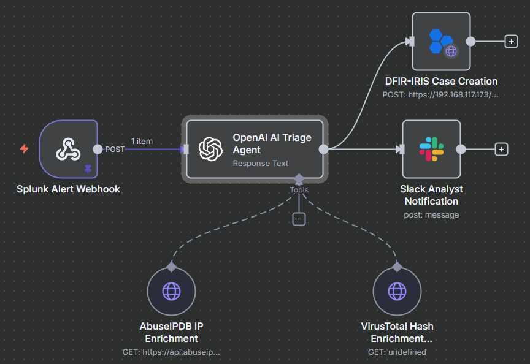
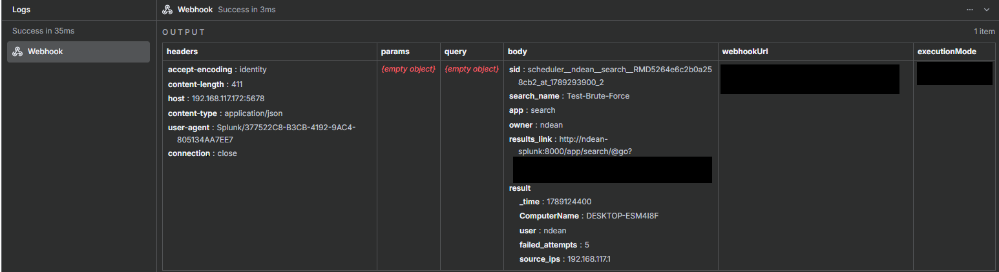
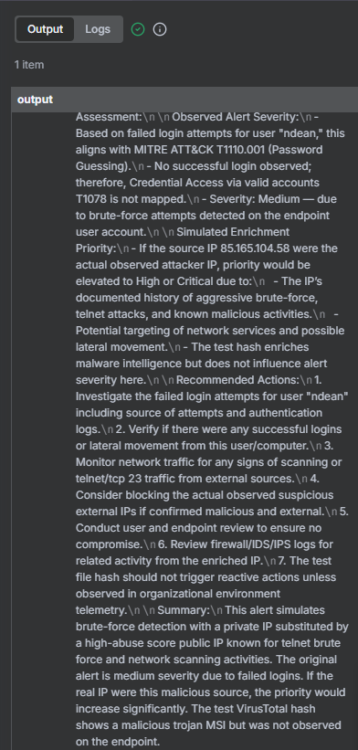
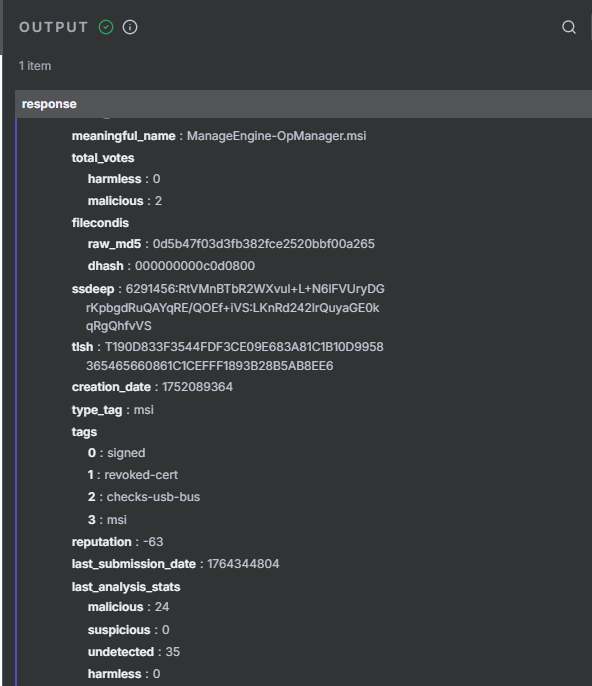
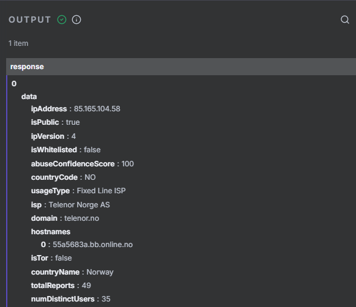
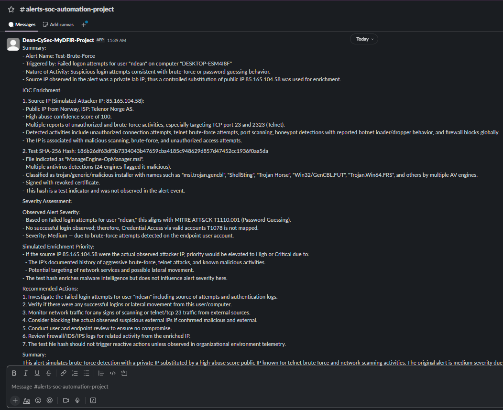

# SOC Automation 2.0 — Implementation Walkthrough

## Overview

This walkthrough documents how the SOC Automation 2.0 lab was built and connected. It follows the alert from Windows endpoint telemetry through Splunk detection, n8n orchestration, AI-assisted analysis, threat-intelligence enrichment, case creation, and analyst notification.

The optional Claude Desktop and Splunk MCP integration is documented separately because it provides analyst-driven access to Splunk rather than participating in the automated alert workflow.

See [Architecture.md](Architecture.md) for the complete system diagram, component roles, and communication paths.

## 1. Lab Environment

The project was built in an isolated virtual lab using the following systems:

| System | Primary Role |
|---|---|
| Windows 10 VM | Endpoint that generates Windows Security, Application, and System Event Logs |
| Splunk Universal Forwarder | Collects configured Windows Event Logs and sends them to Splunk |
| Splunk Enterprise VM | Log ingestion, search, detection, and alert generation |
| n8n VM | Workflow orchestration and integration management |
| OpenAI API | Structured alert analysis and triage-report generation |
| VirusTotal and AbuseIPDB | Hash, URL, domain, and IP-reputation enrichment |
| DFIR-IRIS | Investigation case management |
| Slack | Real-time analyst notification |
| Claude Desktop and Splunk MCP | Optional analyst-assisted Splunk search interface |

The VMs communicated over a private lab network. Credentials, API keys, tokens, and complete webhook URLs are excluded from this repository.

<!-- Add the final architecture diagram or link here if desired. -->

## 2. Windows Event Log and Splunk Ingestion

The Windows 10 endpoint generated Security, Application, System, and operational event logs. The Splunk Universal Forwarder collected the configured Windows Event Log channels and forwarded them to the Splunk Enterprise server over TCP port `9997`.

```text
Windows Event Logs → Splunk Universal Forwarder → Splunk TCP 9997
```

The following items were validated independently:

- Network connectivity between the Windows and Splunk VMs
- Splunk receiving port `9997`
- Splunk Universal Forwarder service status
- Forwarding destination in `outputs.conf`
- Active TCP connection from the endpoint to Splunk
- Arrival of Windows and Sysmon events in Splunk

The results confirmed that Splunk received Security, Application, System, and Terminal Services events from the Windows 10 endpoint.


> A forwarding-destination issue was identified and corrected during setup. 

### Troubleshooting Note

During initial validation, Windows Event Logs were not appearing in Splunk even though network connectivity, TCP port `9997`, and the Splunk Universal Forwarder service were working.

The issue was traced to an incorrect destination in `outputs.conf`. The Universal Forwarder was sending events to the Windows endpoint instead of the Splunk server. After correcting the destination and restarting the forwarder, the connection became established and Windows events appeared in Splunk.

See [Windows Events Not Appearing in Splunk](Troubleshooting-Log.md#1-windows-events-not-appearing-in-splunk) for the complete investigation, configuration correction, commands, and validation evidence.


## 3. Controlled Failed-Logon Simulation

A controlled authentication test was performed against the Windows 10 endpoint by manually entering incorrect credentials multiple times. The activity was performed in the isolated lab to generate repeatable Windows failed-logon events for the automation workflow.

### Simulation Details

| Field | Value |
|---|---|
| Test scenario | Repeated failed Windows logon attempts |
| Target endpoint | `DESKTOP-ESM4I8F` |
| Data source | Windows Security Event Log |
| Event ID | `4625` — An account failed to log on |
| Events observed | `8` |
| MITRE ATT&CK mapping | `T1110 — Brute Force` |
| Possible sub-technique | `T1110.001 — Password Guessing` |

The repeated authentication failures produced Windows Security Event ID `4625`. Splunk received the events through the Universal Forwarder and made the associated timestamp, endpoint, username, and source IP available for detection and investigation.

Event ID `4625` does not automatically prove malicious activity. Failed logons can result from user mistakes, expired credentials, services using old passwords, or legitimate administrative activity. The number of attempts, timeframe, source, target account, and surrounding authentication activity must be considered before escalation.


## 4. Splunk Detection and Alert

Splunk searched the Windows Security logs for repeated failed authentication attempts. Windows Security Event ID `4625` represents an unsuccessful logon.

The detection grouped the events into five-minute intervals and returned a result when at least three failures were associated with the same endpoint and user.

### Detection Details

| Field | Value |
|---|---|
| Detection name | `Test-Brute-Force` |
| Index | `mydfir-project` |
| Source | `WinEventLog:Security` |
| Sourcetype | `WinEventLog` |
| Windows Event ID | `4625` |
| Detection threshold | Three or more failures within five minutes |
| Alert type | Scheduled cron search |
| Trigger condition | Number of results greater than `0` |
| Alert actions | Add to Triggered Alerts and send webhook to n8n |

### Detection Query

```spl
index="mydfir-project" EventCode=4625
| bin _time span=5m
| stats count AS failed_attempts values(src_ip) AS source_ips
    by _time ComputerName user
| where failed_attempts >= 3
```

### Detection Results

The controlled test generated five failed logons for user `ndean` on `DESKTOP-ESM4I8F`. Splunk grouped the events into one five-minute detection window.


*Splunk grouped Windows Security Event ID 4625 records into five-minute intervals and detected five failed logons associated with `ndean` on `DESKTOP-ESM4I8F`.*

### Saved Alert Configuration

The detection was configured as a scheduled Splunk alert. When the query returned a result, Splunk triggered its configured actions, including the webhook request to n8n.


*The enabled Splunk alert and trigger history confirm that the detection executed and the webhook action was configured.*

## 5. n8n Workflow Orchestration

n8n was deployed in Docker and used as the central workflow orchestrator. The workflow received the Splunk alert, prepared the data for analysis, invoked the OpenAI agent and applicable enrichment tools, and delivered the completed output to DFIR-IRIS and Slack.

### Core Workflow Nodes

| Node | Function |
|---|---|
| Webhook | Receives the Splunk alert payload |
| OpenAI agent | Analyzes the evidence and produces a structured triage report |
| VirusTotal enrichment | Retrieves reputation data when supported indicators, such as hashes, are present |
| AbuseIPDB enrichment | Retrieves reputation and abuse-reporting context for IP addresses |
| DFIR-IRIS HTTP request | Creates an investigation case |
| Slack message | Sends the completed analysis to the analyst |

The workflow preserved the original alert evidence and passed only the fields required for analysis and enrichment to external services.

### Workflow Overview



*The n8n workflow coordinates alert ingestion, AI-assisted analysis, enrichment, case creation, and analyst notification.*

### Webhook Reception

The webhook node received the alert sent by Splunk. The payload contained the detection details needed for triage, including the endpoint, user, source IP, failed-logon count, and detection time.



*The successful n8n execution confirms that the Splunk alert reached the automation workflow.*

> **Enrichment note:** The failed-logon scenario contained an IP address suitable for AbuseIPDB enrichment. VirusTotal remained available for alerts containing supported indicators such as file hashes.

### Sanitized Workflow Export

A sanitized copy of the n8n workflow is stored in [`workflow-exports/`](workflow-exports/). Credentials, API tokens, authentication headers, and private webhook URLs were removed before publication.

## 6. AI-Assisted Triage

The OpenAI agent received the Splunk alert fields and produced a structured Tier 1 triage report. The response separated the original endpoint evidence from the controlled indicators used to validate the threat-intelligence integrations.

### Triage Results

| Category | Result |
|---|---|
| Observed activity | Five failed logons for `ndean` on `DESKTOP-ESM4I8F` |
| Observed source | Private lab address |
| Severity | Medium |
| MITRE ATT&CK tactic | Credential Access |
| MITRE ATT&CK technique | T1110.001 — Password Guessing |
| Compromise status | Not confirmed |
| Simulated IP priority | High if the substituted reputation belonged to the observed source |
| VirusTotal result | Integration validated; hash not observed on the endpoint |

The report recommended reviewing authentication logs for a subsequent successful login, validating the true source of the attempts, reviewing related network evidence, and applying containment only when supported by confirmed evidence.



*The OpenAI agent rated the observed failed-logon activity as Medium severity and separated it from the higher simulated priority produced through controlled threat-intelligence enrichment.*

The AI-generated assessment was treated as decision support. Final severity, containment, and escalation decisions remained the responsibility of the analyst.

## 7. Threat-Intelligence Enrichment

VirusTotal and AbuseIPDB were connected as enrichment tools available to the OpenAI agent through the n8n workflow.

### VirusTotal Hash Enrichment

VirusTotal was configured as an optional enrichment tool for alerts containing supported file hashes. Because the failed-logon event did not contain a hash, a controlled SHA-256 value was supplied to validate the integration.

At the time of testing, VirusTotal identified the file as `ManageEngine-OpManager.msi`. The analysis results showed `24` malicious detections, `35` undetected results, and `0` suspicious results. Additional metadata identified the sample as an MSI file with signing and revoked-certificate tags.



*VirusTotal returned file metadata and antivirus analysis statistics for the controlled SHA-256 test indicator.*

The hash was not observed on `DESKTOP-ESM4I8F` and was not connected to the failed-logon activity. The result only demonstrated how the workflow could enrich a hash when one is present in a future alert.

Detailed configuration and sanitized request examples are available in [Threat-Intelligence-Enrichment.md](Threat-Intelligence-Enrichment.md).

### AbuseIPDB IP Enrichment

AbuseIPDB was configured to enrich public IP addresses associated with security alerts. The original failed-logon event contained the private lab address `192.168.117.1`, which could not provide meaningful public reputation information.

To validate the integration, `85.165.104.58` was supplied as a controlled public-IP substitute. At the time of testing, AbuseIPDB returned an abuse confidence score of `100`, with `49` reports from `35` distinct users. The response also included country, ISP, domain, and usage-type information.



*AbuseIPDB returned reputation context for the controlled public IP used to simulate production enrichment.*

The substituted address was not observed in the original Windows event. The enrichment was treated as supporting context and did not replace the original Splunk evidence or prove account compromise. In a real alert containing a public source IP, the workflow would submit the observed address directly to AbuseIPDB.

See [Threat-Intelligence-Enrichment.md](Threat-Intelligence-Enrichment.md) for field mappings and sanitized request examples.

## 8. DFIR-IRIS Alert Creation and Case Escalation

After the AI triage report was returned, n8n submitted the selected fields to the DFIR-IRIS Alerts API. The successful API response confirmed that DFIR-IRIS created a new alert with Medium severity.

### Alert Field Mapping

| DFIR-IRIS Field | Workflow Value |
|---|---|
| Alert title | Splunk alert name |
| Description | Complete AI-generated triage report |
| Severity | Medium |
| Status | Unspecified — awaiting analyst triage |
| Customer | IrisInitialClient |

The alert description included:

- Detection name
- Affected host and user
- Observed failed-logon activity
- MITRE ATT&CK mapping
- AbuseIPDB and VirusTotal test-enrichment context
- Severity assessment
- Recommended investigation steps
- Evidence limitations

### API Response


*The DFIR-IRIS API returned a successful response and created alert ID 10 with Medium severity.*

### Created DFIR-IRIS Alert


*DFIR-IRIS received the Splunk detection and AI-generated analysis as a structured alert awaiting analyst review.*

The alert remained in the triage queue until an analyst reviewed the evidence. If further investigation were required, the analyst could escalate the alert into a new case or merge it into an existing case.

This approach preserved human review while automating alert documentation and ticket creation.

See [DFIR-IRIS-Integration.md](DFIR-IRIS-Integration.md) for the API mapping and alert-field details.

## 9. Slack Analyst Notification

n8n sent the completed AI-assisted triage report to the dedicated Slack SOC channel. This allowed the analyst to review and prioritize the alert without immediately opening each connected platform.

The notification included:

- Splunk alert name
- Affected endpoint and user
- Observed failed-logon activity
- Medium observed-alert severity
- MITRE ATT&CK mapping
- AbuseIPDB and VirusTotal enrichment results
- Separation between observed evidence and controlled test indicators
- Recommended investigation actions
- Evidence limitations



*The n8n Slack integration delivered the completed AI-assisted triage report to the dedicated SOC alert channel.*

The Slack message provided situational awareness but did not replace the original Splunk evidence or the DFIR-IRIS alert record. The analyst remained responsible for validating the findings and deciding whether escalation or containment was appropriate.

### Analyst-Driven Splunk Investigations

Claude performed two read-only investigations through the Splunk MCP server. The first validated the failed-logon activity that triggered the automated workflow. The second reviewed PowerShell, Atomic Red Team, and Mimikatz-related telemetry from September 13.

#### Failed-Logon Investigation

Claude searched for Windows Security Event ID `4625` on `DESKTOP-ESM4I8F` between 11:00 and 11:10 UTC on September 11, 2026.

The search returned five failed network logons within approximately 16 seconds:

| Field | Validated Result |
|---|---|
| Event ID | `4625` |
| Endpoint | `DESKTOP-ESM4I8F` |
| User | `ndean` |
| Source IP | `192.168.117.1` |
| Failed attempts | `5` |
| Time window | `11:03:55–11:04:11 UTC` |
| Logon type | `3 — Network` |
| Authentication package | `NTLM` |
| Failure reason | Incorrect password or unknown username |
| Detection mapping | `T1110.001 — Password Guessing` |

The activity matched the Splunk detection threshold. Additional context showed that the internal source address was also associated with the user's normal remote sessions. Because the activity was generated by manually entering incorrect Windows credentials, it represented controlled password-guessing behavior rather than a confirmed hostile attack.


#### PowerShell and Mimikatz Investigation

Claude also searched the September 13 telemetry for PowerShell, Atomic Red Team, and Mimikatz-related evidence.

| Evidence | Finding |
|---|---|
| Event IDs `4103` and `4104` | PowerShell module and script-block activity was recorded |
| Atomic Red Team files | Framework configuration and module files were loaded |
| ATT&CK mapping | Observed PowerShell activity supports `T1059.001 — PowerShell` |
| Defender Event ID `1116` | Mimikatz was detected during download |
| Defender Event ID `1117` | Defender successfully quarantined the detected file |
| Mimikatz execution | Not confirmed |
| Credential dumping | Not observed or confirmed |
| Exact Atomic test command | Not present in the returned events |

The literal technique identifier `T1059.001` did not appear in the indexed events. The mapping was made from the observed PowerShell telemetry. Atomic Red Team framework activity was present, but the results did not independently confirm the exact Atomic test command.

Mimikatz was detected and quarantined during the download process. Therefore, the evidence does not support claiming that Mimikatz executed or accessed LSASS memory.


### Analyst Validation

Claude helped organize the evidence and identify investigation pivots, but Splunk remained the source of truth. All MCP-returned findings were compared with the original events before ATT&CK mappings or conclusions were documented.

No Splunk data, saved searches, alerts, or configurations were modified during either MCP investigation.

## 11. End-to-End Validation

The completed workflow was validated from the original Windows authentication events through analyst notification and investigation support.

| Validation Point | Expected Result | Actual Result | Status |
|---|---|---|---|
| Windows event ingestion | Splunk receives Windows Security events | Event ID `4625` was searchable in `mydfir-project` | Passed |
| Splunk detection | Detect at least three failures within five minutes | Five failures were detected within approximately 16 seconds | Passed |
| Splunk webhook | Send the alert payload to n8n | n8n received the alert name, host, user, source IP, and failure count | Passed |
| AI triage | Generate a structured alert assessment | OpenAI returned a summary, ATT&CK mapping, severity, enrichment, and recommended actions | Passed |
| AbuseIPDB | Enrich a supported public IP address | The controlled public IP returned reputation and abuse-reporting context | Passed |
| VirusTotal | Enrich a supported SHA-256 hash | The controlled test hash returned file-reputation results | Passed |
| DFIR-IRIS | Create an investigation alert | DFIR-IRIS created the alert with Medium severity and the AI-generated report | Passed |
| Slack | Notify the analyst | The complete triage report was delivered to the project channel | Passed |
| Splunk MCP | Support read-only analyst investigations | Claude retrieved and summarized failed-logon, PowerShell, and Defender events | Passed |
| Human validation | Separate observations from simulated enrichment | The private source IP, public-IP substitution, test hash, and unconfirmed activity were clearly identified | Passed |

### Validation Outcome

The project successfully demonstrated an end-to-end SOC alert-triage pipeline:

```text
Windows Event Logs → Splunk detection → n8n webhook
→ OpenAI analysis and enrichment → DFIR-IRIS alert
→ Slack notification → Analyst validation
## Security and Publishing Notes

- All activity was performed in an isolated and authorized lab.
- Screenshots must be reviewed for credentials, tokens, and complete webhook URLs.
- Workflow and configuration exports must contain placeholders only.
- Private keys, `.env` files, credential databases, and live API tokens must not be committed.
- Hostnames and private IP addresses may be sanitized when they are not necessary to understand the evidence.
