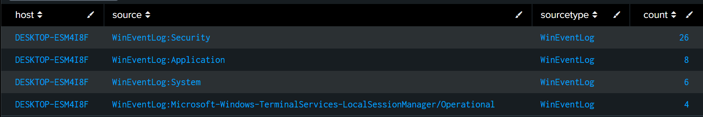
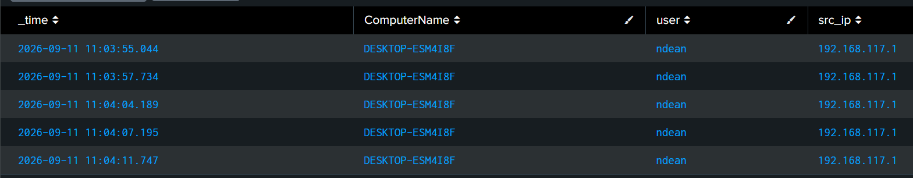
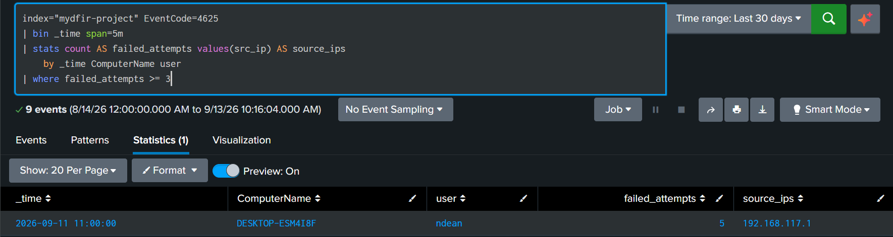
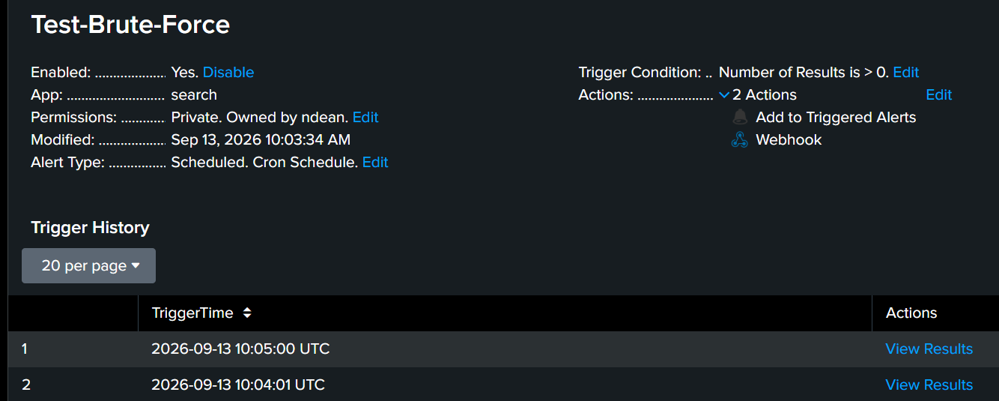

# SOC Automation 2.0 — Implementation Walkthrough

## Overview

This walkthrough documents how the SOC Automation 2.0 lab was built and connected. It follows the alert from Windows endpoint telemetry through Splunk detection, n8n orchestration, AI-assisted analysis, threat-intelligence enrichment, case creation, and analyst notification.

The optional Claude Desktop and Splunk MCP integration is documented separately because it provides analyst-driven access to Splunk rather than participating in the automated alert workflow.

See [Architecture.md](Architecture.md) for the complete system diagram, component roles, and communication paths.

## 1. Lab Environment

The project was built in an isolated virtual lab using the following systems:

| System | Primary Role |
|---|---|
| Windows 10 VM | Endpoint that generates Windows Security, Application, and System Event Logs |
| Splunk Universal Forwarder | Collects configured Windows Event Logs and sends them to Splunk |
| Splunk Enterprise VM | Log ingestion, search, detection, and alert generation |
| n8n VM | Workflow orchestration and integration management |
| OpenAI API | Structured alert analysis and triage-report generation |
| VirusTotal and AbuseIPDB | Hash, URL, domain, and IP-reputation enrichment |
| DFIR-IRIS | Investigation case management |
| Slack | Real-time analyst notification |
| Claude Desktop and Splunk MCP | Optional analyst-assisted Splunk search interface |

The VMs communicated over a private lab network. Credentials, API keys, tokens, and complete webhook URLs are excluded from this repository.

<!-- Add the final architecture diagram or link here if desired. -->

## 2. Windows Event Log and Splunk Ingestion

The Windows 10 endpoint generated Security, Application, System, and operational event logs. The Splunk Universal Forwarder collected the configured Windows Event Log channels and forwarded them to the Splunk Enterprise server over TCP port `9997`.

```text
Windows Event Logs → Splunk Universal Forwarder → Splunk TCP 9997
```

The following items were validated independently:

- Network connectivity between the Windows and Splunk VMs
- Splunk receiving port `9997`
- Splunk Universal Forwarder service status
- Forwarding destination in `outputs.conf`
- Active TCP connection from the endpoint to Splunk
- Arrival of Windows and Sysmon events in Splunk

The results confirmed that Splunk received Security, Application, System, and Terminal Services events from the Windows 10 endpoint.



> A forwarding-destination issue was identified and corrected during setup. 

### Troubleshooting Note

During initial validation, Windows Event Logs were not appearing in Splunk even though network connectivity, TCP port `9997`, and the Splunk Universal Forwarder service were working.

The issue was traced to an incorrect destination in `outputs.conf`. The Universal Forwarder was sending events to the Windows endpoint instead of the Splunk server. After correcting the destination and restarting the forwarder, the connection became established and Windows events appeared in Splunk.

See [Windows Events Not Appearing in Splunk](Troubleshooting-Log.md#1-windows-events-not-appearing-in-splunk) for the complete investigation, configuration correction, commands, and validation evidence.


## 3. Controlled Failed-Logon Simulation

A controlled authentication test was performed against the Windows 10 endpoint by manually entering incorrect credentials multiple times. The activity was performed in the isolated lab to generate repeatable Windows failed-logon events for the automation workflow.

### Simulation Details

| Field | Value |
|---|---|
| Test scenario | Repeated failed Windows logon attempts |
| Target endpoint | `DESKTOP-ESM4I8F` |
| Data source | Windows Security Event Log |
| Event ID | `4625` — An account failed to log on |
| Events observed | `8` |
| MITRE ATT&CK mapping | `T1110 — Brute Force` |
| Possible sub-technique | `T1110.001 — Password Guessing` |

The repeated authentication failures produced Windows Security Event ID `4625`. Splunk received the events through the Universal Forwarder and made the associated timestamp, endpoint, username, and source IP available for detection and investigation.

Event ID `4625` does not automatically prove malicious activity. Failed logons can result from user mistakes, expired credentials, services using old passwords, or legitimate administrative activity. The number of attempts, timeframe, source, target account, and surrounding authentication activity must be considered before escalation.



## 4. Splunk Detection and Alert

Splunk searched the Windows Security logs for repeated failed authentication attempts. Windows Security Event ID `4625` represents an unsuccessful logon.

The detection grouped the events into five-minute intervals and returned a result when at least three failures were associated with the same endpoint and user.

### Detection Details

| Field | Value |
|---|---|
| Detection name | `Test-Brute-Force` |
| Index | `mydfir-project` |
| Source | `WinEventLog:Security` |
| Sourcetype | `WinEventLog` |
| Windows Event ID | `4625` |
| Detection threshold | Three or more failures within five minutes |
| Alert type | Scheduled cron search |
| Trigger condition | Number of results greater than `0` |
| Alert actions | Add to Triggered Alerts and send webhook to n8n |

### Detection Query

```spl
index="mydfir-project" EventCode=4625
| bin _time span=5m
| stats count AS failed_attempts values(src_ip) AS source_ips
    by _time ComputerName user
| where failed_attempts >= 3
```

### Detection Results

The controlled test generated five failed logons for user `ndean` on `DESKTOP-ESM4I8F`. Splunk grouped the events into one five-minute detection window.



*Splunk grouped Windows Security Event ID 4625 records into five-minute intervals and detected five failed logons associated with `ndean` on `DESKTOP-ESM4I8F`.*

### Saved Alert Configuration

The detection was configured as a scheduled Splunk alert. When the query returned a result, Splunk triggered its configured actions, including the webhook request to n8n.



*The enabled Splunk alert and trigger history confirm that the detection executed and the webhook action was configured.*

## 5. n8n Workflow Orchestration

n8n was deployed in Docker and used as the central workflow orchestrator. The workflow received the Splunk alert, prepared the data for analysis, invoked the AI agent and enrichment tools, and delivered the final output to DFIR-IRIS and Slack.

### Core Workflow Nodes

| Node | Function |
|---|---|
| Webhook | Receives the Splunk alert payload |
| OpenAI agent | Analyzes the alert and produces the structured triage report |
| VirusTotal enrichment | Retrieves supported hash, file, URL, or domain context |
| AbuseIPDB enrichment | Retrieves IP-reputation and abuse-reporting context |
| DFIR-IRIS HTTP request | Creates or updates the investigation case |
| Slack message | Sends the analyst notification |

The workflow preserved the original alert evidence and passed only the required fields to external services.

<!-- Screenshot: screenshots/01-core-automation/05-n8n-core-workflow.png -->

A sanitized workflow export should be stored in [`workflow-exports/`](workflow-exports/). Credential values, tokens, and webhook secrets must be removed before publishing.

## 6. OpenAI Triage Agent

The OpenAI agent received the normalized alert context from n8n. The prompt required a structured response so the output could be used consistently by DFIR-IRIS and Slack.

### Required Triage Output

- Executive alert summary
- Observed evidence and affected assets
- Severity and confidence assessment
- MITRE ATT&CK mapping
- Threat-intelligence enrichment results
- Evidence gaps and limitations
- Recommended investigation steps
- Suggested containment or escalation actions

The prompt instructed the model to distinguish observed evidence from analytical conclusions and to avoid inventing missing facts.

<!-- Screenshot: screenshots/01-core-automation/06-openai-triage-output.png -->

## 7. Threat-Intelligence Enrichment

VirusTotal and AbuseIPDB were connected as enrichment tools available to the OpenAI agent through the n8n workflow.

### VirusTotal

VirusTotal was used when the alert contained a supported hash, URL, domain, or other indicator. The response added reputation and detection context to the triage report.

<!-- Screenshot: screenshots/02-threat-intelligence/01-virustotal-enrichment.png -->

### AbuseIPDB

AbuseIPDB was used when the alert contained an IP address. The response added confidence, reporting, and reputation context to the analysis.

<!-- Screenshot: screenshots/02-threat-intelligence/02-abuseipdb-enrichment.png -->

Enrichment did not replace the original Splunk evidence. It was treated as supporting context and remained subject to analyst validation.

See [Threat-Intelligence-Enrichment.md](Threat-Intelligence-Enrichment.md) for the field mappings and sanitized request examples.

## 8. DFIR-IRIS Case Creation

After the AI triage report was returned, n8n sent the selected fields to DFIR-IRIS. The resulting case provided a central location for investigation tracking.

The case included:

- Alert and detection name
- Severity and confidence
- Affected host and user
- Evidence summary
- MITRE ATT&CK mapping
- VirusTotal and AbuseIPDB context
- Recommended investigation steps
- Original event references

<!-- Screenshot: screenshots/03-dfir-iris/01-dfir-iris-case-created.png -->

See [DFIR-IRIS-Integration.md](DFIR-IRIS-Integration.md) for the API mapping and case-field details.

## 9. Slack Analyst Notification

n8n also sent a concise summary to Slack so the analyst could review the alert in real time. The Slack message contained enough information for initial prioritization while directing the analyst to the full DFIR-IRIS case and Splunk evidence.

The notification included:

- Alert name and severity
- Affected endpoint
- Short evidence summary
- Enrichment highlights
- Recommended next action
- DFIR-IRIS case reference, when available

<!-- Screenshot: screenshots/01-core-automation/07-slack-analyst-notification.png -->

## 10. Claude Desktop and Splunk MCP

Claude Desktop was configured as an optional analyst-assistance interface. It communicated with a local Splunk MCP server, which acted as the controlled query bridge to the Splunk REST API over HTTPS port `8089`.

```text
Claude Desktop ↔ Splunk MCP server ↔ Splunk REST API
```

This path allowed an analyst to request approved Splunk searches using natural language and receive summarized results. It did not trigger the n8n workflow and did not replace direct validation in Splunk.

Configuration examples must use placeholders instead of real Splunk credentials.

<!-- Screenshot: screenshots/04-splunk-mcp-claude/01-claude-mcp-configuration-sanitized.png -->
<!-- Screenshot: screenshots/04-splunk-mcp-claude/02-claude-splunk-search-results.png -->

See [Splunk-MCP-Claude.md](Splunk-MCP-Claude.md) for configuration and validation details.

## 11. End-to-End Validation

The completed workflow was validated from telemetry generation through analyst notification:

1. Controlled activity generated Windows and Sysmon events.
2. The Universal Forwarder delivered the events to Splunk.
3. The Splunk detection returned the expected matching event.
4. Splunk triggered the n8n webhook.
5. n8n submitted the alert to the OpenAI agent.
6. VirusTotal and AbuseIPDB returned applicable enrichment.
7. OpenAI produced the required structured triage report.
8. n8n created the DFIR-IRIS case.
9. n8n delivered the Slack notification.
10. The analyst compared the automation output with the original Splunk evidence.

Detailed expected results, actual results, and evidence references are maintained in [Testing-Validation.md](Testing-Validation.md).

## Outcome

The project demonstrates how SIEM detection, workflow orchestration, threat intelligence, AI-assisted analysis, case management, and analyst notification can be combined into one repeatable SOC triage process.

The automation reduces repetitive evidence-handling work while preserving human responsibility for validation, escalation, and response decisions.

## Security and Publishing Notes

- All activity was performed in an isolated and authorized lab.
- Screenshots must be reviewed for credentials, tokens, and complete webhook URLs.
- Workflow and configuration exports must contain placeholders only.
- Private keys, `.env` files, credential databases, and live API tokens must not be committed.
- Hostnames and private IP addresses may be sanitized when they are not necessary to understand the evidence.
